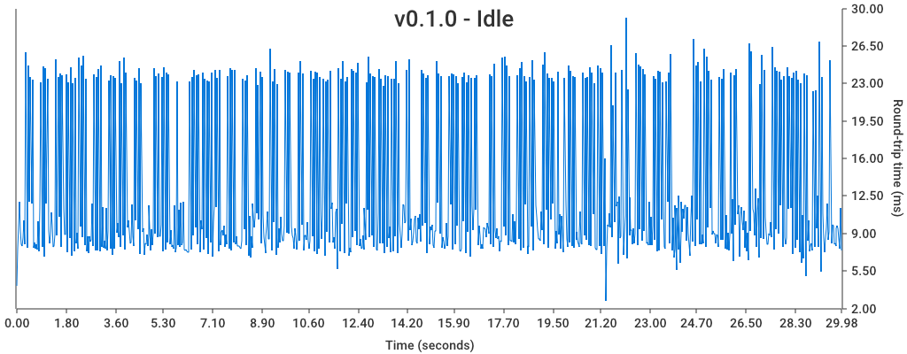
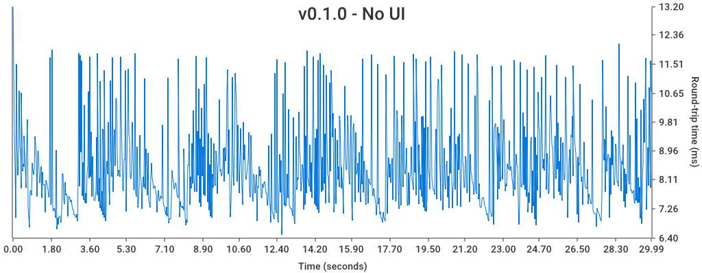
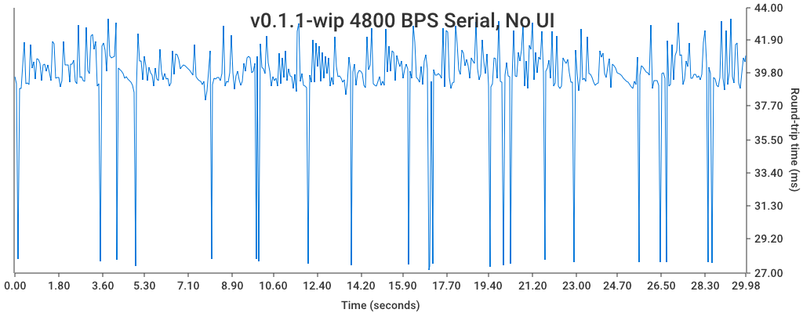

# Mega MIDI Ping Pong [](https://github.com/rhargreaves/mega-midi-ping-pong/actions)

Measures performance of the [Mega Drive MIDI Interface](https://github.com/rhargreaves/mega-drive-midi-interface) by sending it the "Ping" SysEx MIDI command and timing how long it takes for the "Pong" SysEx reply to be received.

## Getting Started

### Requirements

- Golang 1.11

### Usage

1. Build:

```sh
$ make
```

2. List MIDI devices:

```sh
$ go run ping_pong.go -list

ID: 0   Name: IAC Driver IAC Bus 1      Input: true     Output: false
ID: 1   Name: IAC Driver IAC Bus 2      Input: true     Output: false
ID: 2   Name: IAC Driver IAC Bus 1      Input: false    Output: true
ID: 3   Name: IAC Driver IAC Bus 2      Input: false    Output: true
```

3. Run with correct device IDs specified:

```sh
# go run ping_pong.go -in <input_device> -out <output_device>

$ go run ping_pong.go -in 0 -out 3

In: IAC Driver IAC Bus 1
Out: IAC Driver IAC Bus 2
2019-10-27T19:14:43.923466Z: Ping? Pong! (3.396952ms)
2019-10-27T19:14:44.12993Z: Ping? Pong! (20.398833ms)
2019-10-27T19:14:44.353178Z: Ping? Pong! (20.760178ms)
2019-10-27T19:14:44.577685Z: Ping? Pong! (19.596641ms)
2019-10-27T19:14:44.80165Z: Ping? Pong! (3.319763ms)
2019-10-27T19:14:45.00694Z: Ping? Pong! (5.519903ms)
2019-10-27T19:14:45.216816Z: Ping? Pong! (19.197244ms)
2019-10-27T19:14:45.440896Z: Ping? Pong! (18.86333ms)
2019-10-27T19:14:45.663128Z: Ping? Pong! (19.8471ms)
...
```

### Help

```sh
$ go run ping_pong.go -h

Usage of ping_pong:
  -graph-filename string
        Graph Filename (default "results/output.png")
  -graph-title string
        Graph Title
  -in uint
        In Device ID
  -list
        List Devices
  -out uint
        Out Device ID
```

## Results

### v0.1.0





### v0.1.1-wip



### v0.1.1-wip2 / v0.2.0


