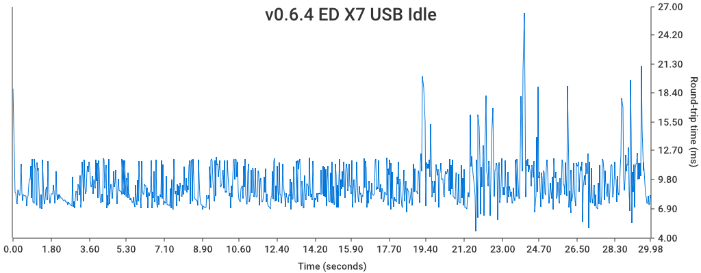
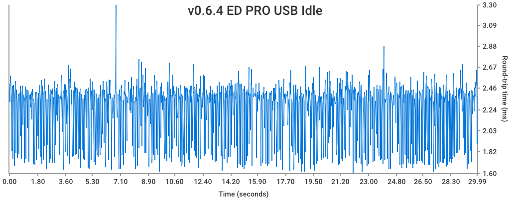
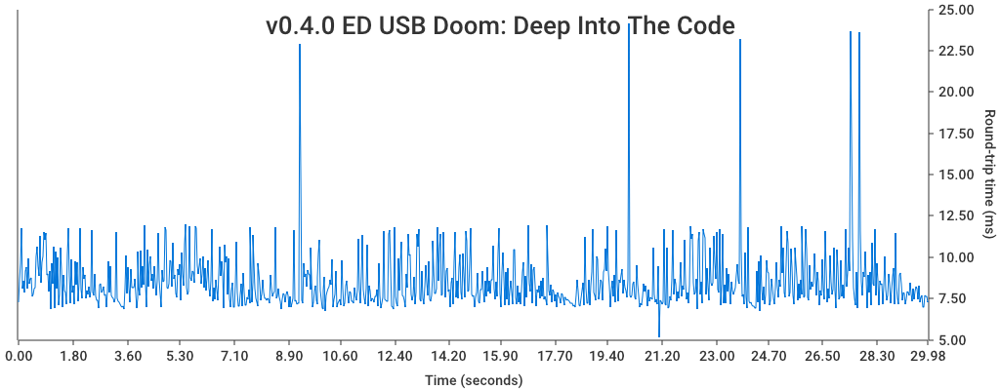
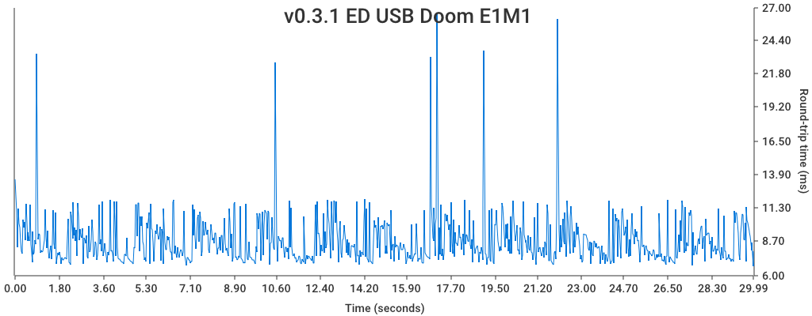
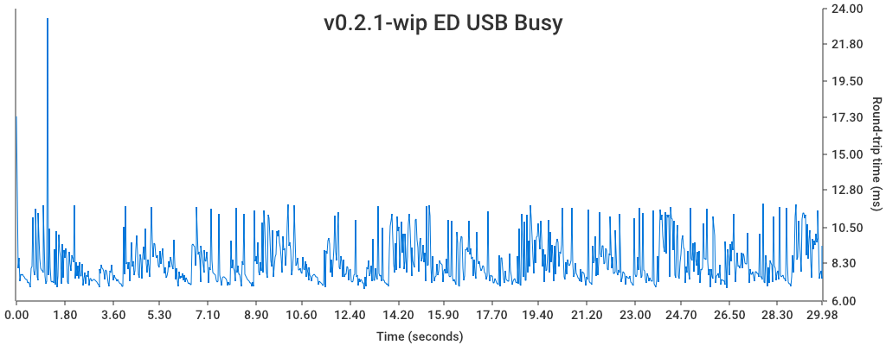
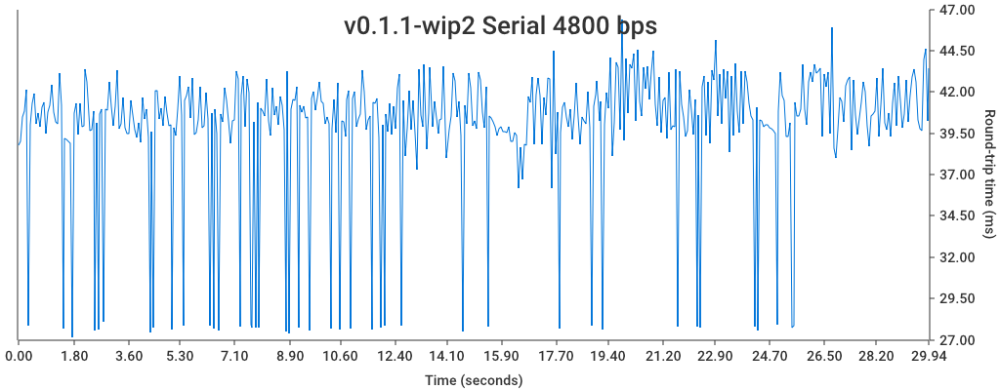
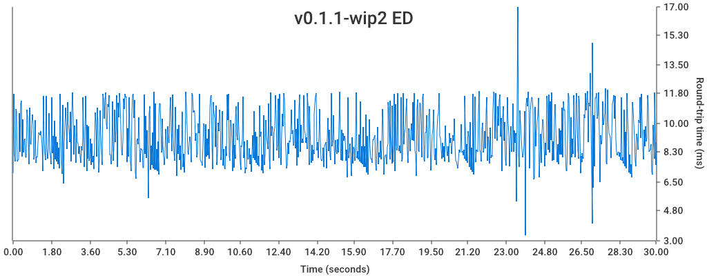

# Mega MIDI Ping Pong [](https://github.com/rhargreaves/mega-midi-ping-pong/actions)

> [!NOTE]  
> This project has been deprecated in favour of the [Mega Drive MIDI Interface CLI](https://github.com/rhargreaves/mdmi-cli) which offers performance testing functionality as well as other helpful operations

---

Measures performance of the [Mega Drive MIDI Interface](https://github.com/rhargreaves/mega-drive-midi-interface) by sending it the "Ping" SysEx MIDI command and timing how long it takes for the "Pong" SysEx reply to be received.

## Getting Started

### Requirements

- Python 3.13

### Usage

1. Install dependencies:

```sh
$ make install
```

2. List MIDI devices:

```sh
$ python3 -m ping_pong --list

Input Devices:
IAC Driver Bus 1
IAC Driver Bus 2

Output Devices:
IAC Driver Bus 1
IAC Driver Bus 2
```

3. Run with correct device IDs specified:

```sh
$ python3 -m ping_pong \
      --in "IAC Driver Bus 2" \
      --out "IAC Driver Bus 1" \
      --count 10
0.102962: Ping? Pong! (18.665ms)
0.121661: Ping? Pong! (16.917ms)
0.138600: Ping? Pong! (15.382ms)
0.154004: Ping? Pong! (15.733ms)
0.169767: Ping? Pong! (16.869ms)
0.186669: Ping? Pong! (20.831ms)
0.207532: Ping? Pong! (11.515ms)
0.219075: Ping? Pong! (14.223ms)
0.233325: Ping? Pong! (15.945ms)
0.249300: Ping? Pong! (17.479ms)
```

### Help

```sh
$ python3 -m ping_pong -h
usage: __main__.py [-h] [--in IN_PORT] [--out OUT_PORT] [--graph-title GRAPH_TITLE]
                   [--graph-filename GRAPH_FILENAME] [--list] [--count COUNT]

MIDI Ping-Pong Test

options:
  -h, --help            show this help message and exit
  --in IN_PORT          Input MIDI port name
  --out OUT_PORT        Output MIDI port name
  --graph-title GRAPH_TITLE
                        Graph title
  --graph-filename GRAPH_FILENAME
                        Graph filename
  --list                List MIDI devices
  --count COUNT         Number of ping-pongs to perform (0 for unlimited)
```

## Theorectical Performance Limits

### Serial Mode:

```
Max link speed = 4800 bps

4800 bps / (8 bits + 1 Start Bit + 1 Stop Bit = 10 bits per byte) = 480 bytes per second

Ping = F0 00 22 77 01 F7 = 6 bytes
Pong = F0 00 22 77 02 F7 = 6 bytes
------------------------------------
Total Ping+Pong Data Size = 12 bytes

480 / 12 = 40 Ping/Pong round trip per second

1000ms / 40 = 1 Ping/Pong round trip per 25 ms
```

## Results

Below are the results of performance tests ran against versions of the [Mega Drive MIDI Interface](https://github.com/rhargreaves/mega-drive-midi-interface)

### Current Version

#### v0.6.4





### Previous Versions

#### v0.4.2-wip



#### v0.3.1



#### v0.2.1



#### v0.1.1-wip2 / v0.2.0




